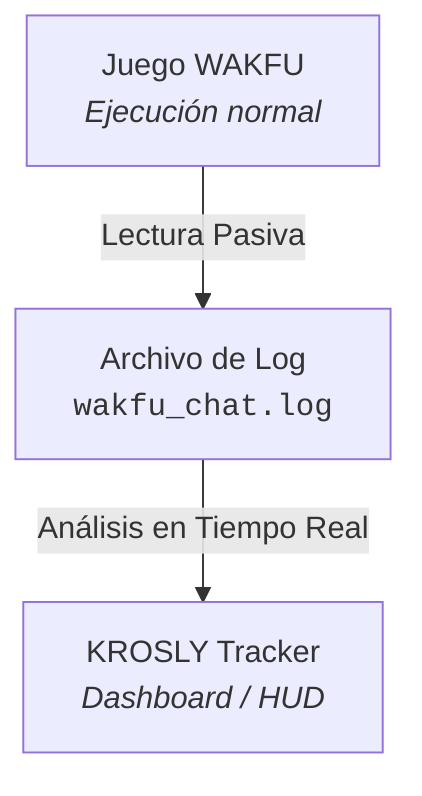

# Release & User Guide: Krosly (Wakfu Tracker)

**Krosly** es una aplicación de escritorio gratuita diseñada para ayudarte a monitorizar tu progreso en el MMORPG **WAKFU**. Funciona leyendo en tiempo real el archivo de registros (*log*) que genera el cliente del juego, mostrando métricas avanzadas y estadísticas mediante un panel de control interactivo (*Dashboard*) y una interfaz superpuesta transparente (*HUD Overlay*).

> [!TIP]
> 🛡️ **Seguridad Garantizada:** Krosly es un tracker 100% pasivo. **NO** modifica archivos del juego, **NO** inyecta código y **NO** interactúa con el proceso de WAKFU. Es totalmente seguro y respetuoso con los términos del juego.

---

## 📋 Tabla de Contenidos

- [Características Principales](#-características-principales)
  - [Vistas Disponibles](#vistas-disponibles)
- [¿Cómo Funciona?](#-cómo-funciona)
- [Requisitos del Sistema](#-requisitos-del-sistema)
- [Instalación](#-instalación)
- [Guía de Primer Uso](#-guía-de-primer-uso)
- [Atajos y Modos del HUD](#-atajos-y-modos-del-hud)
- [Solución de Problemas Comunes](#-solución-de-problemas-comunes)
- [Idiomas Soportados](#-idiomas-soportados)
- [Aviso Legal](#-aviso-legal)

---

## ✨ Características Principales

Krosly rastrea automáticamente y en tiempo real las siguientes métricas durante tus sesiones de juego:

* **Kamas:** Registro detallado de ingresos y gastos.
* **Recolección de Recursos:** Contador de ítems recolectados con valoración personalizada.
* **Experiencia (XP):** Progreso de nivel de personaje y nivel de oficios.
* **Combates:** Estadísticas de victorias, derrotas y rendimiento en peleas.
* **Artesanía (Crafting):** Identificación de recetas fabricables según los ítems de tu inventario.

### Vistas Disponibles

* **Panel de Control (Dashboard):** Muestra un análisis exhaustivo de todas tus estadísticas. Permite asignar valor comercial a tus recursos para calcular el valor neto de tu inventario y el margen de beneficio de cada receta.
* **HUD Overlay:** Ventana transparente orientada al juego en tiempo real. Muestra datos esenciales (Kamas, estado de combates, XP, valor del inventario) sin obstaculizar la visión del juego.
* **Historial de Sesiones:** Módulo de persistencia que guarda tus sesiones automáticamente para consultar, analizar o eliminar registros históricos.

---

## 🔍 ¿Cómo Funciona?

Krosly opera en segundo plano leyendo de forma pasiva el archivo de texto `wakfu_chat.log` creado de manera nativa por el cliente de WAKFU.

---

## 💻 Requisitos del Sistema

* **Sistema Operativo:** Windows (64 bits).*
* **Juego:** Cliente de WAKFU instalado.
* **Ruta Predeterminada del Log:**
  * **Windows:** `%APPDATA%/zaap/gamesLogs/wakfu/logs/wakfu_chat.log`

> [!NOTE]
> *Actualmente, Krosly solo está disponible para Windows. Se evaluará la compatibilidad con otras plataformas en futuras versiones.

---

## 🚀 Instalación

1. Dirígete a la sección de **Releases** en este repositorio.
2. Descarga el instalador (`krosly_1.0.0-beta.1_x64-setup.exe`).
3. Ejecuta el instalador y sigue las instrucciones en pantalla.
4. Inicia Krosly desde el acceso directo creado en el menú de inicio o en el escritorio.

> [!WARNING]
> Al iniciar la aplicación por primera vez, es posible que observes un **breve flash blanco**. Esto es un comportamiento normal del WebView al cargar la interfaz y será corregido en una futura actualización para una experiencia más pulida.

---

## 📖 Guía de Primer Uso

1. **Configuración del Log:** Si la aplicación no detecta la ruta automáticamente, ve a `Configuración → Archivo de Log` y selecciona manualmente el archivo `wakfu_chat.log`.
2. **Gestión de Precios (Opcional):**
   * En el Dashboard, haz clic en el icono de moneda (💰) ubicado en la tarjeta de **Recolección** o **Crafteo**.
   * Selecciona o busca el ítem deseado, asigna su precio de mercado y haz clic en **Guardar**.
   * Esto activará el cálculo del valor total del inventario y la rentabilidad de las recetas.
3. **Activar el HUD Overlay:**
   * Haz clic en el botón **Overlay** dentro del Dashboard.
   * El HUD aparecerá sobre la pantalla del juego. Puedes posicionarlo a tu gusto y cambiar entre sus distintos modos de visualización.

---

## ⌨️ Atajos y Modos del HUD

| Acción | Método de Ejecución |
| :--- | :--- |
| **Mostrar / Ocultar HUD** | Botón **Overlay** en el Dashboard o control dedicado del HUD. |
| **Expandir / Reducir HUD** | Botones de minimizar/maximizar dentro de la interfaz del HUD. |
| **Modo Ultra-Compacto** | Presionar el botón `-` (menos) en el HUD compacto para ocultar temporalmente la barra de XP y el indicador TTL. |

---

## 🛠️ Solución de Problemas Comunes

- **El archivo de Log no se detecta:**
  - Asegúrate de que el archivo exista en la ruta especificada. Puedes seleccionarlo manualmente desde la pestaña de **Configuración**.
- **Los precios personalizados no persisten:**
  - Confirma haber hecho clic en el botón **Guardar** tras modificar el precio. Los datos se almacenan de manera local en SQLite y se recuperan automáticamente al reiniciar.
- **El HUD parpadea o presenta problemas de redimensionamiento:**
  - Reinicia la aplicación. Si el comportamiento persiste, cambia entre el modo compacto y expandido para restablecer el viewport de la ventana.

---

## 🌐 Idiomas Soportados

* 🇪🇸 **Español:** Disponible y completo.
* 🇬🇧 **Inglés:** Funcional (detección de eventos y backend). La interfaz de usuario está en fase de pulido; se agradece feedback para completar las traducciones.
* 🇫🇷 **Francés:** Funcional (detección de eventos y backend). La interfaz de usuario está en fase de pulido; se agradece feedback para completar las traducciones.
* 🇵🇹 **Portugués:** Funcional (detección de eventos y backend). La interfaz de usuario está en fase de pulido; se agradece feedback para completar las traducciones.

---

## ⚖️ Aviso Legal

**Krosly** es un proyecto independiente desarrollado por fans y para fans. **No está afiliado, respaldado ni vinculado oficialmente con Ankama Games**. Todos los nombres, marcas, íconos e imágenes de ítems son propiedad intelectual de Ankama. Esta aplicación se distribuye "tal cual", de forma gratuita y sin garantías.
